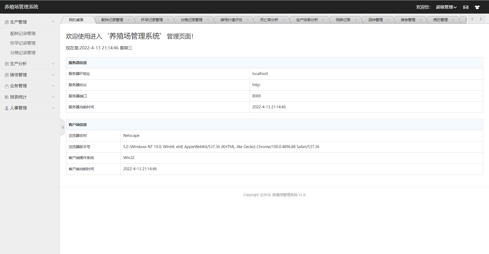
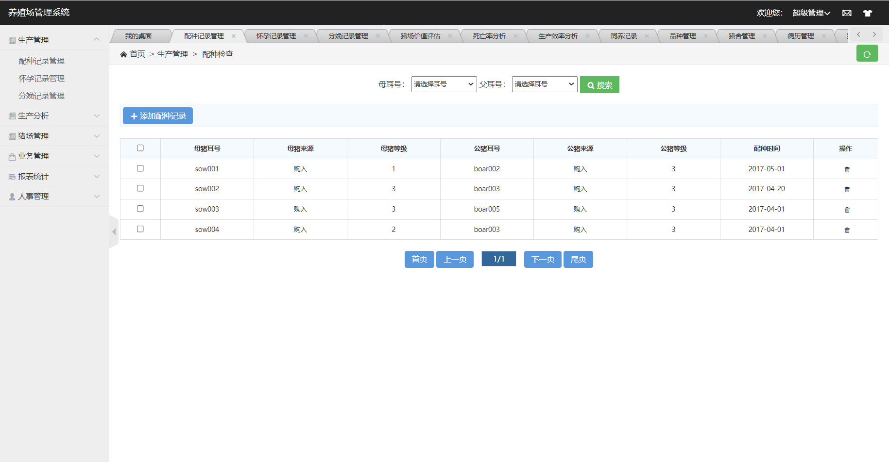
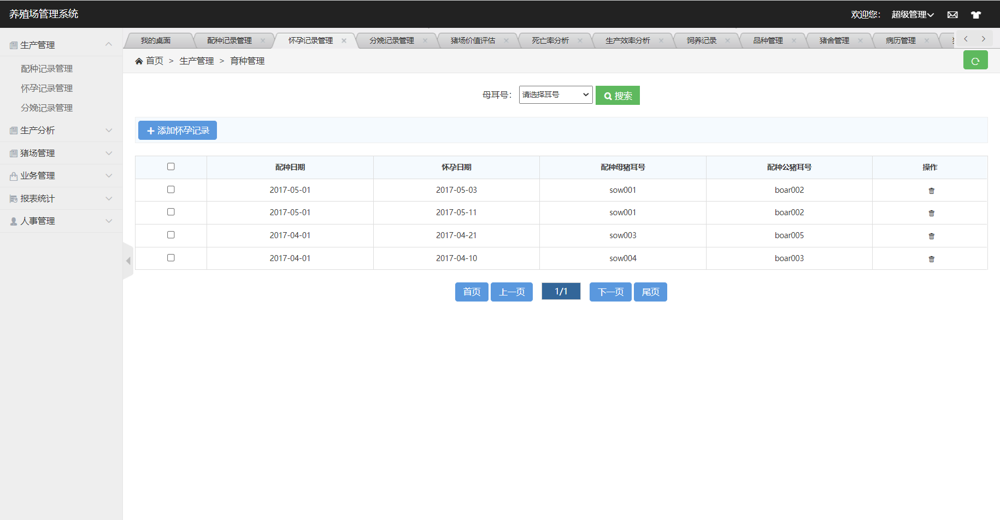
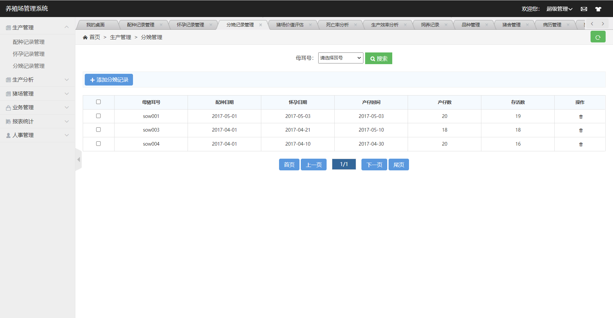
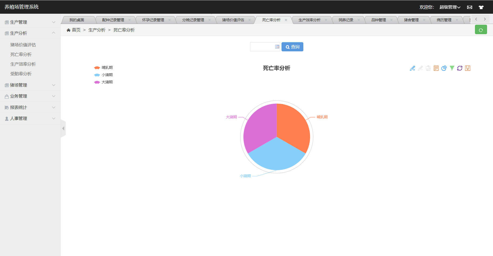
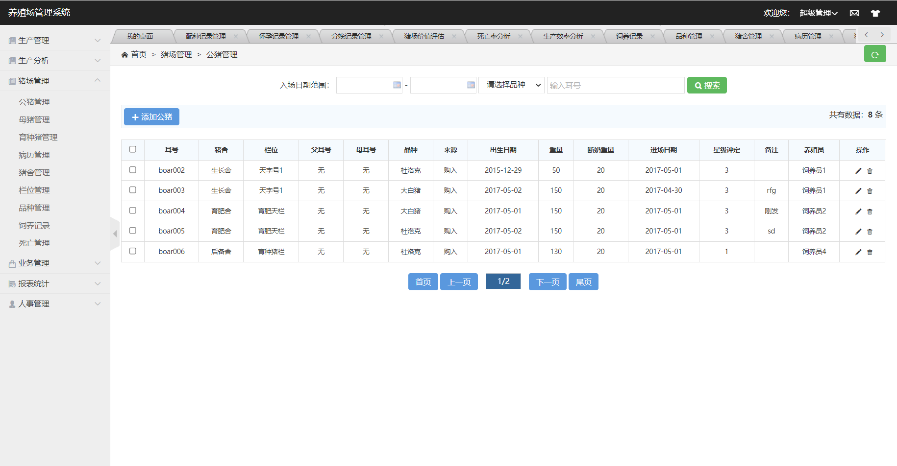
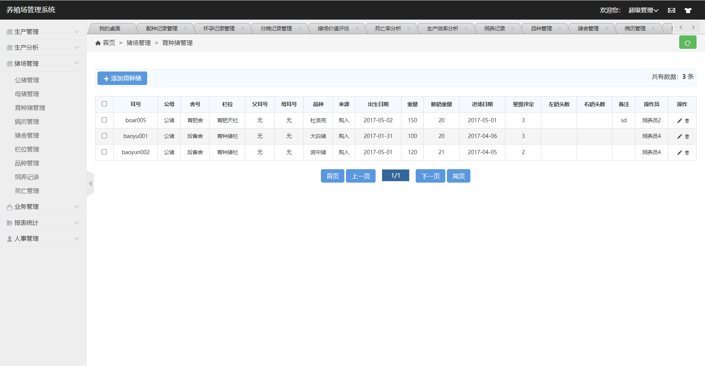
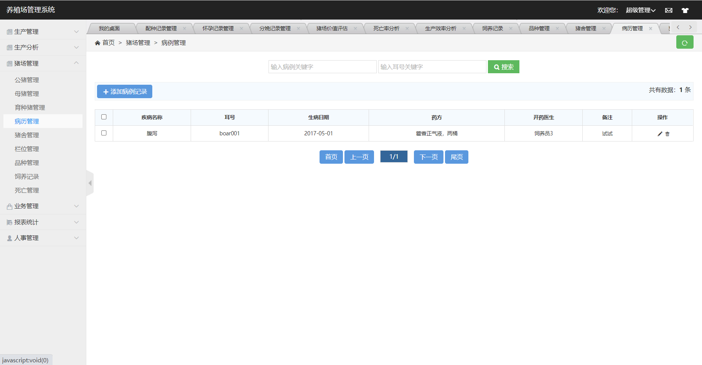
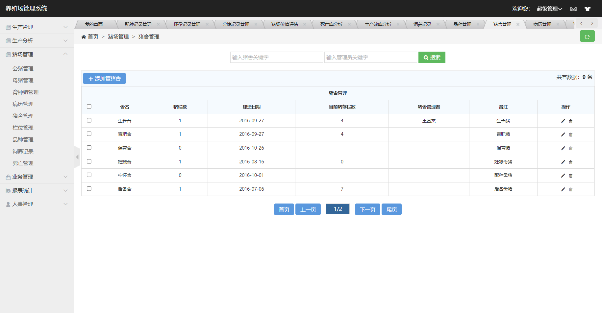
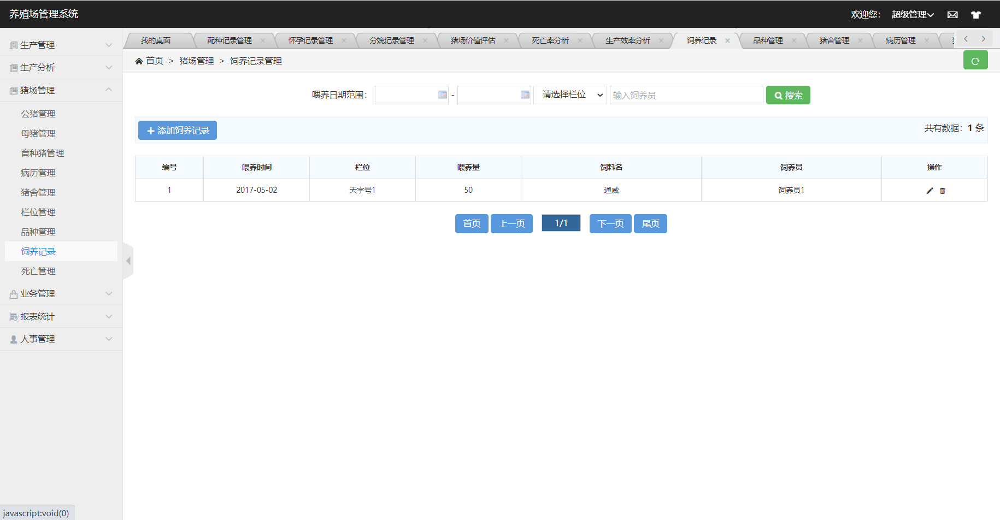

🎓 毕业设计 | 基于 SSM 的养殖场管理系统 🐔🌾

🌱 研究背景:
养殖业是农业领域的重要组成部分，但管理一家养殖场通常需要耗费大量的时间和资源。为了提高效率，我选择了开发一款基于 SSM 技术栈的养殖场管理系统。这个系统将帮助养殖场主们更好地管理饲养、销售和库存，从而提高生产效益。

🌐 技术路线:

后端：Spring 框架提供了核心的业务逻辑处理，Spring MVC 用于构建 RESTful API，MyBatis 用于数据库交互。
前端：使用 HTML、CSS 和 JavaScript 构建用户友好的界面，实现数据可视化。
数据库：MySQL 存储饲养数据、销售记录和库存信息。
📋 功能需求:
1️⃣ 用户管理：养殖场主可以注册和登录，管理自己的养殖场信息。

2️⃣ 饲养管理：记录动物的饲养信息，包括喂养、生长和健康状态。

3️⃣ 销售管理：跟踪销售订单，生成销售报告。

4️⃣ 库存管理：管理饲料、药物和其他库存物品，自动计算库存成本。

5️⃣ 数据分析：提供图表和统计数据，帮助养殖场主做出决策。

 **

### 可访问www.pangpangbysj.com查看其他设计或者联系我
** 
购买可访问https://mbd.pub/o/bread/Zpmak5tr

